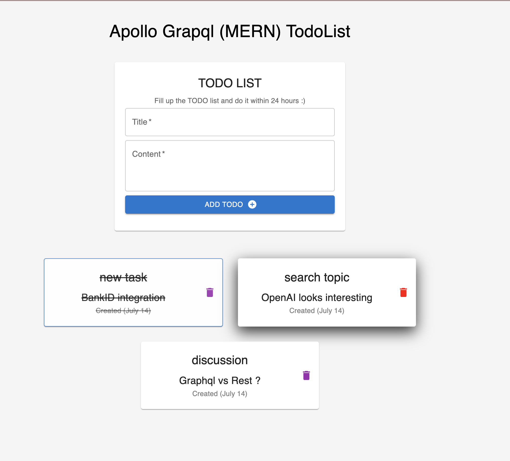

### The goal of this task is to create a Todo List application that allows users to manage their tasks. The application will follow the MERN stack architecture, which means it will utilize MongoDB as the database, Express.js as the backend framework, React as the frontend library, and Node.js as the runtime environment. Additionally, Apollo GraphQL will be used for handling the GraphQL API. By combining these technologies and implementing the necessary components and logic, you will create a full-stack Todo List application that allows users to manage their tasks effectively

